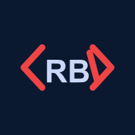

<p align="center">
  
</p>

<p align="center">
  <a href="https://react.dev"></a>&nbsp;&nbsp;
  <a href="https://developer.mozilla.org/en-US/docs/Web/JavaScript"></a>&nbsp;&nbsp;
  <a href="https://tailwindcss.com"></a>&nbsp;&nbsp;
  <a href="https://gsap.com"></a>&nbsp;&nbsp;
  <a href="https://reactrouter.com"></a>
</p>

My Personal portfolio website :)

---

## Table of Contents

- [Features](#features)
- [Prerequisites](#prerequisites)
- [Getting Started](#getting-started)
  - [Installation](#installation)
  - [Running Locally](#running-locally)
- [Project Structure](#project-structure)
- [Available Scripts](#available-scripts)
- [Deployment](#deployment)

## Features

- **Single-page layout** - Smooth scroll navigation across Home, About, Skills, Experience, Education, Projects, and Contact sections
- **GSAP animations** - Scroll-driven and entrance animations throughout
- **Tailwind CSS** - Utility-first styling with responsive design
- **Data-driven content** - All profile, work, and project data managed from a single `siteData.js` file

## Prerequisites

- Node.js >= 16.x
- npm >= 8.x

## Getting Started

### Installation

```bash
git clone https://github.com/RBCodewalker/RBCodewalker.github.io.git
cd RBCodewalker.github.io
npm install
```

### Running Locally

```bash
# Start development server
npm start

# Application runs at http://localhost:3000
```

## Project Structure

```
src/
├── components/          # Reusable UI components
├── data/
│   └── siteData.js      # All site content (profile, skills, work, education)
├── pages/               # Page-level section components
└── App.js               # Application entry point
```

## Available Scripts

| Script | Description |
|--------|-------------|
| `npm start` | Start development server |
| `npm run build` | Build for production |
| `npm test` | Run tests in watch mode |
| `npm run deploy` | Build and deploy to GitHub Pages |

## Deployment

The site is deployed on a private domain `rajdeepbastakoti.com` via netlify.

---

Copyright © 2026 Rajdeep Bastakoti. All rights reserved.
